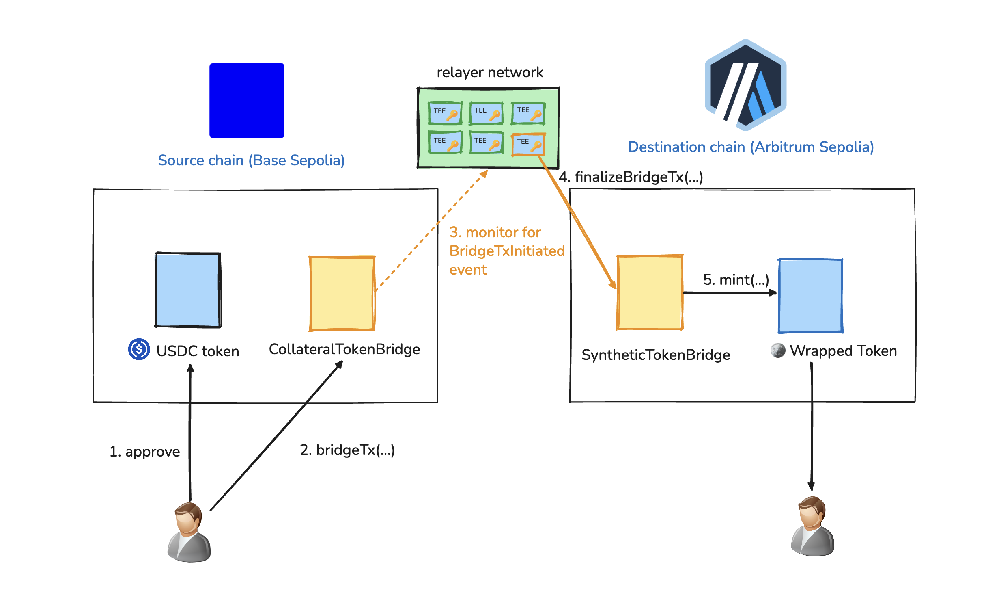

# L2 Mint-and-Lock Bridge

A bidirectional bridge for Circle testnet USDC between Base Sepolia and Arbitrum Sepolia.


<!--
```

            ..                                       ..
            []                                       []
          .:[]:_                                   ,:[]:.
        .: :[]: :-.                             ,-: :[]: :.
      .: : :[]: : :`._                       ,.': : :[]: : :.
    .: : : :[]: : : : :-._               _,-: : : : :[]: : : :.
_..: : : : :[]: : : : : : :-._________.-: : : : : : :[]: : : : :-._
_:_:_:_:_:_:[]:_:_:_:_:_:_:_:_:_:_:_:_:_:_:_:_:_:_:_:[]:_:_:_:_:_:_
!!!!!!!!!!!![]!!!!!!!!!!!!!!!!!!!!!!!!!!!!!!!!!!!!!!![]!!!!!!!!!!!!!
^^^^^^^^^^^^[]^^^^^^^^^^^^^^^^^^^^^^^^^^^^^^^^^^^^^^^[]^^^^^^^^^^^^^
            []       =========================       []
            []       | L2 ERC20 Token Bridge |       []
            []       =========================       []
``` -->

## Architecture Overview



## Chains, tokens and contracts

### 🟦 Base Sepolia (chain ID: 84532)

| Contract                | Address                                                                                                                         |
| ----------------------- | ------------------------------------------------------------------------------------------------------------------------------- |
| Circle testnet USDC     | [`0x036CbD53842c5426634e7929541eC2318f3dCF7e`](https://sepolia.basescan.org/address/0x036CbD53842c5426634e7929541eC2318f3dCF7e) |
| `CollateralTokenBridge` | [`0x9C5DB618c29e99e71BC6aD10c4Cc3c5544a31921`](https://sepolia.basescan.org/address/0x9C5DB618c29e99e71BC6aD10c4Cc3c5544a31921) |

### ⬜️ Arbitrum Sepolia (chain ID: 421614)

| Contract               | Address                                                                                                                        |
| ---------------------- | ------------------------------------------------------------------------------------------------------------------------------ |
| `SyntheticTokenBridge` | [`0x3096e98a82dd7a1adfaa71d0def8f7cfd3d43ea0`](https://sepolia.arbiscan.io/address/0x3096e98a82dd7a1adfaa71d0def8f7cfd3d43ea0) |
| Wrapped USDC (`wUSDC`) | [`0x4fd6979AfE5C83653ef1d4ffd0581A491a53DEF0`](https://sepolia.arbiscan.io/address/0x4fd6979AfE5C83653ef1d4ffd0581A491a53DEF0) |

This L2 Bridge showcases bridging testnet USDC, a real asset and a real ERC20 approval + `transferFrom`.

Base Sepolia USDC is locked as collateral and an equivalent 6-decimal `wUSDC` is minted on Arbitrum Sepolia.
Bridging back involves burning `wUSDC` on Arbitrum Sepolia before unlocking the original USDC on Base Sepolia.

## How it works? Flow

The core invariant of the bridge is that USDC locked in the `CollateralTokenBridge` contract on Base Sepolia **MUST always be greater than or equal to the total supply of `wUSDC`** on Arbitrum Sepolia. (we factor the case if a user transfer arbitrarily with `CollateralTokenBridge` contract address as `recipient`).

### Bridging: Base ➡ Arbitrum

1. The user give as allowance to the `CollateralTokenBridge` the amount it wants to bridge. This is done by calling `approve(...)` on the USDC token contract.
2. The user calls `bridgeTx(...)` on the `CollateralTokenBridge` contract. Under the hood, the bridge calls `transferFrom` to take the user's tokens and lock them in the smart contract.
3. When `bridgeTx(...)` is called, it emits a `BridgeTxInitiated` event that the relayer listens to on the source chain (`Base`).
4. The relayer waits five confirmations, validates the event's message ID, and calls `finalizeBridgeTx(...)` on the `SyntheticTokenBridge` contract on the destination chain.
5. `SyntheticTokenBridge` marks the message processed and mints the same amount of `wUSDC`.

### Bridging back: Base ⬅ Arbitrum

The reverse path performs the same steps as above, with the following differences:

- at step 2, the user calls `bridgeTx(...)` on the `SyntheticTokenBridge` contract, which burns the `wUSDC` via `burnFrom(...)`.
- at step 4, the relayer completes the return path by calling `finalizeBridgeTx(...)` on the `CollateralTokenBridge`.
- at step 5, the `CollateralTokenBridge` marks the message processed and unlock the same amount of USDC.

### Bridge message ID format

Every message ID of a bridge transaction is the keccak256 hash of the following properties.

```javascript
keccak256(
  abi.encode(
    originChainId,
    destinationChainId,
    tokenAddress,
    sender,
    recipient,
    amount,
    senderNonce,
  ),
);
```

## Security, Trust model and tradeoffs

### Smart Contracts

- Chain ID in the message ID prevents cross-chain replay.
- nonces enable to prevent replay a bridge message twice.
- destination-side `processed` mapping prevents duplicate finalization (if multiple relayers are running and the same bridge message ID is picked by two different relayers)

The bridge contracts inherit `Ownable2Step` and `Pausable`, which allows a circuit breaker if the bridge or relayer is compromised.

The bridge contract use the `SafeERC20` library to ensure the bridge always integrate ERC20 compliant tokens that return `true` when the `transferFrom` function is called, and reject non-standard tokens. The `SafeERC20` library allows `transferFrom` calls that do not return any data (like USDT), but if data is returned, it must be a `true` boolean.

### Relayer

Decided to use the trusted relayer model for simplicity. The bridge intentionally trusts one relayer EOA via the `onlyRelayer` modifier in the smart contract.

The relayer only reads blocks five confirmations behind the origin head, which protects against shallow testnet reorgs. Production should use finalized L1 batch status, or more confirmations.

## What was cut and why

| Cut                            | Why                                                      | Production direction                                                                                                      |
| ------------------------------ | -------------------------------------------------------- | ------------------------------------------------------------------------------------------------------------------------- |
| Trusted Relayer                | Time; the single-relayer trust model is explicit         | Relayer private key should run on a TEE + some economic mechanisms with slashing should be put in place                   |
| Fees / destination gas payment | It changes contracts, relayer, and UI together           | Enforced fee floor with off-chain quotes via oracles and relayer withdrawals so they can pay for the gas on relayed chain |
| Failed-finalization recovery   | This is the most security-sensitive bridge path          | Attested-failure refunds or a carefully designed timeout reclaim                                                          |
| Rate limits and caps           | Low value on a public testnet demo                       | Per-message and per-block limits                                                                                          |
| Rebalancing / third chain      | Requires a liquidity model                               | Asset gateway registry and routers. Allowing to rebalance                                                                 |
| Real-USDC fork tests           | Unit tests and live smoke testing cover the initial path | Base Sepolia fork test against deployed USDC bytecode                                                                     |

## Further improvements

The next priorities:

- signature verification
- gas fees
- safe stuck-fund recovery
- rate limits
- finalized L1 confirmation
- a durable indexed message API
- and a gateway registry for additional assets and chains

## AI usage

Architecture and tradeoffs were decided up front in `SPECIFICATIONS.md`. AI implemented that written design, while the security-sensitive message identity, nonce, replay, and trust assumptions remained fixed by the specification.
