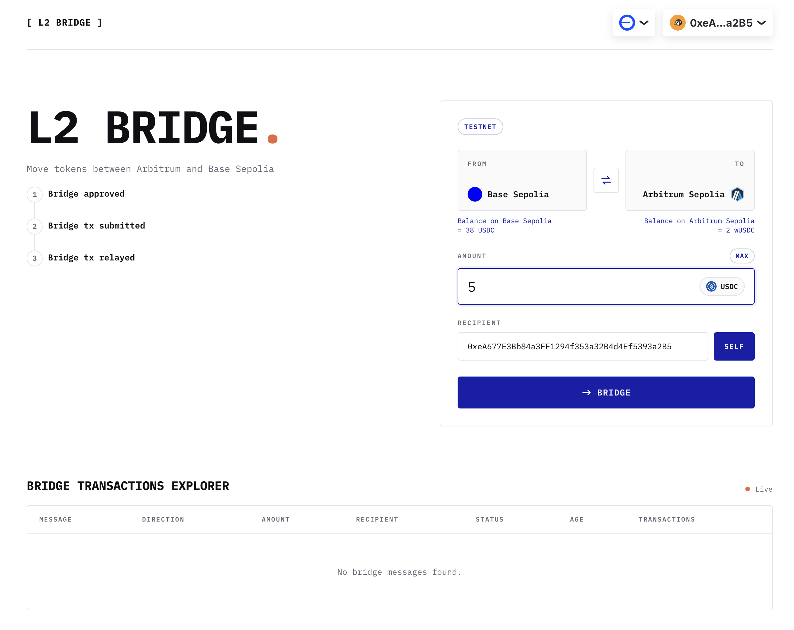

# L2 Mint-and-Lock Bridge

A bidirectional bridge for Circle testnet USDC between Base Sepolia and Arbitrum Sepolia. Base USDC is locked as collateral and an equivalent 6-decimal `wUSDC` is minted on Arbitrum; returning burns `wUSDC` before releasing the original USDC.



<!-- 
```
                                         
            ..                                       ..
            []                                       []
          .:[]:_                                   ,:[]:.
        .: :[]: :-.                             ,-: :[]: :.
      .: : :[]: : :`._                       ,.': : :[]: : :.
    .: : : :[]: : : : :-._               _,-: : : : :[]: : : :.
_..: : : : :[]: : : : : : :-._________.-: : : : : : :[]: : : : :-._
_:_:_:_:_:_:[]:_:_:_:_:_:_:_:_:_:_:_:_:_:_:_:_:_:_:_:[]:_:_:_:_:_:_
!!!!!!!!!!!![]!!!!!!!!!!!!!!!!!!!!!!!!!!!!!!!!!!!!!!![]!!!!!!!!!!!!!
^^^^^^^^^^^^[]^^^^^^^^^^^^^^^^^^^^^^^^^^^^^^^^^^^^^^^[]^^^^^^^^^^^^^
            []       =========================       []
            []       | L2 ERC20 Token Bridge |       []
            []       =========================       []
``` -->

```text
Base Sepolia                                      Arbitrum Sepolia
 user → CollateralTokenBridge → BridgeTxInitiated
                                  │
                         trusted relayer
                                  │
                                  └→ SyntheticTokenBridge → wUSDC

 user ← CollateralTokenBridge ← trusted relayer ← BridgeTxInitiated ← burn wUSDC
```

## Chains and token

| Network | Chain ID | Asset | Contract |
| --- | ---: | --- | --- |
| Base Sepolia | 84532 | Circle testnet USDC | [`0x036C…CF7e`](https://sepolia.basescan.org/address/0x036CbD53842c5426634e7929541eC2318f3dCF7e) |
| Arbitrum Sepolia | 421614 | Wrapped USDC (`wUSDC`) | Set after deployment in `addresses.json` |

This L2 Bridge showcases bridging testnet USDC, a real asset and a real ERC20 approval + `transferFrom`.

## How it works? Flow

The core invariant of the bridge is that USDC locked in the `CollateralTokenBridge` contract on Base Sepolia **MUST always be greater than or equal to the total supply of `wUSDC`** on Arbitrum Sepolia. (we factor the case if a user transfer arbitrarily with `CollateralTokenBridge` contract address as `recipient`).

### Bridging: Base ➡ Arbitrum

1. The user give as allowance to the `CollateralTokenBridge` the amount it wants to bridge. This is done by calling `approve(...)` on the USDC token contract.
2. The user calls `bridgeTx(...)` on the `CollateralTokenBridge` contract. Under the hood, the bridge calls `transferFrom` to take the user's tokens and lock them in the smart contract.
3. When `bridgeTx(...)` is called, it emits a `BridgeTxInitiated` event that the relayer listens to on the source chain (`Base`).
4. The relayer waits five confirmations, validates the event's message ID, and calls `finalizeBridgeTx(...)` on the `SyntheticTokenBridge` contract on the destination chain.
5. `SyntheticTokenBridge` marks the message processed and mints the same amount of `wUSDC`.

### Bridging back: Base ⬅ Arbitrum

The reverse path performs the same steps as above, with the following differences:
- at step 2, the user calls `bridgeTx(...)` on the `SyntheticTokenBridge` contract; it burns the approved `wUSDC`.
- the relayer completes the return path by calling `finalizeBridgeTx(...)` on the `CollateralTokenBridge`.

### Bridge message ID format

Every message ID of a bridge transaction is the keccak256 hash of the following properties:

- origin chain ID
- destination chain ID
- canonical token address (USDC)
- sender
- recipient
- amount (of tokens being bridged), 
- per-sender nonce

These arguments are `abi.encode` and padded according to the ABI specification format. 


## Security, Trust model and tradeoffs

- Chain IDs prevent cross-chain replay
- nonces distinguish repeated transfers
- destination-side `processed` mapping prevents duplicate finalization.

The bridge intentionally trusts one relayer EOA via the `onlyRelayer` modifier in the smart contract.

The bridge contracts inherit `Ownable2Step` and `Pausable`, which allows a circuit breaker if the bridge or relayer is compromised.

Authorization is simple and explicit, but compromise or censorship of that key can mint invalid claims or stop delivery. 

The relayer only reads blocks five confirmations behind the origin head, which protects against shallow testnet reorgs. Production would use finalized L1 batch status. Per-sender nonces avoid global ordering

<!-- The UI indexes recent logs directly. This removes backend infrastructure for the demo, but repeated 50,000-block scans do not scale. -->

## What was cut and why

| Cut | Why | Production direction |
| --- | --- | --- |
| Relayer signature verification | Time; the single-relayer trust model is explicit | EIP-712, n-of-m attestations, key rotation |
| Fees / destination gas payment | It changes contracts, relayer, and UI together | Enforced fee floor with off-chain quotes and relayer withdrawals |
| Failed-finalization recovery | This is the most security-sensitive bridge path | Attested-failure refunds or a carefully designed timeout reclaim |
| Rate limits and caps | Low value on a public testnet demo | Per-message and per-block limits |
| Rebalancing / third chain | Requires a liquidity model | Asset gateway registry and routers |
| Dedicated indexer | Zero-infrastructure UI is sufficient here | Relayer ledger API or production indexer |
| Real-USDC fork tests | Unit tests and live smoke testing cover the initial path | Base Sepolia fork test against deployed USDC bytecode |


## Deployment addresses

Deployment-specific values and starting blocks live in `addresses.json`. Blank bridge values mean the project has not yet been deployed; the UI remains read-only and the relayer rejects startup until they are populated.

## Further improvements

The next priorities are signature verification, gas fees, safe stuck-fund recovery, rate limits, finalized L1 confirmation, a durable indexed message API, and a gateway registry for additional assets and chains.

## AI usage

Architecture and tradeoffs were decided up front in `SPECIFICATIONS.md`. AI implemented that written design, while the security-sensitive message identity, nonce, replay, and trust assumptions remained fixed by the specification.